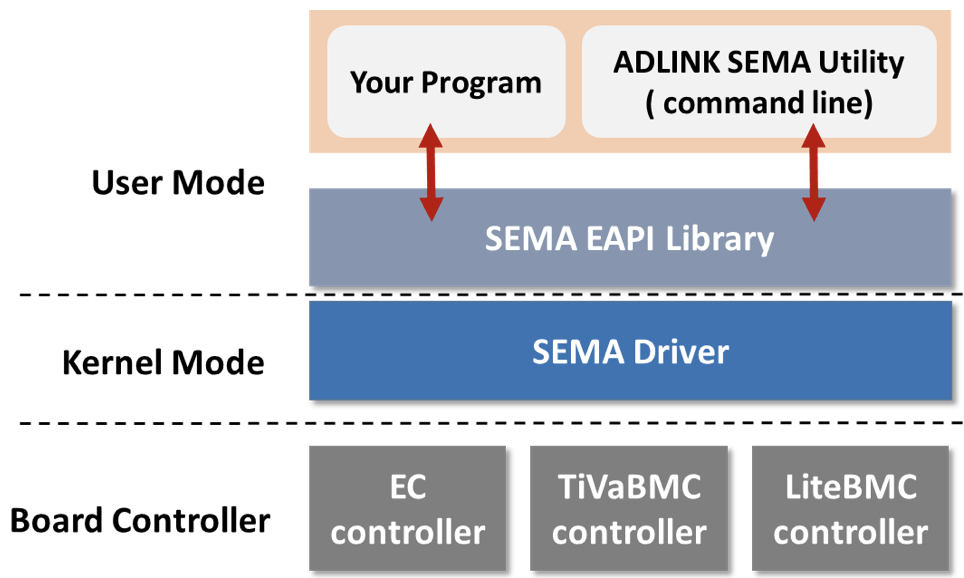

# What is SEMA?

**The Smart Embedded Management Agent (SEMA®)**

Downtime of devices or systems is not acceptable in today's industries. To help customers analyze their systems and take countermeasures for preventive maintenance, we provide a solution that can promptly monitor and collect system performance and status information from the hardware.

A Board Management Controller is embedded in our hardware and collects all relevant technical information from the chipset through different communication interfaces, such as eSPI, I2C, and SMBus.

SEMA® middleware is on top of the Board controller. It provides a ready-made application that shows the data in user-friendly graphic interfaces suitable for supervision and troubleshooting.

## 1. Architecture Overview

SEMA EAPI Library provides you with an interface that the drivers and controllers can access.

**Note:** EAPI (Embedded API) library: PICMG® organization defined the software specification on COM Express for the industrial applications. Here is the available specification https://www.picmg.org/wp-content/uploads/COM_EAPI_R1_0.pdf for your reference.

## 2. Feature Set

SEMA® is designed to monitor and access the following features on ADLINK boards.

1) Power consumption
2) User area access
3) I2C control
4) Monitoring the temperature of the CPU and board
5) Accessing board information(Serial number, Part number, Version of the firmware)
6) Fan control
7) GPIO access for the expander(PCA9535, SX1509)
8) Watchdog

## 3. Software Documentation

* [SEMA Installation Guide for Windows](https://www.adlinktech.com/Products/DownloadMDownload?lang=en&pdNo=1274&MainCategory=Industrial_IoT_and_Cloud_solutions&kind=M)

   
